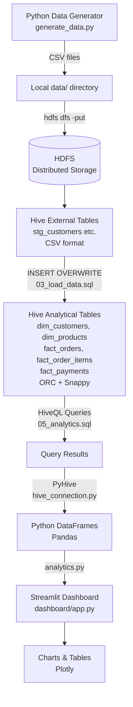

# E-Commerce Data Warehouse and Analytics using Apache Hive and Python

> **College BDA Project** — demonstrates the difference between transactional (OLTP) and analytical (OLAP) systems using a simulated e-commerce dataset, Apache Hive, and a Python/Streamlit dashboard.

---

## Table of Contents

1. [Project Overview](#1-project-overview)
2. [Problem Statement](#2-problem-statement)
3. [Objectives](#3-objectives)
4. [Architecture](#4-architecture)
5. [Technology Stack](#5-technology-stack)
6. [Dataset Description](#6-dataset-description)
7. [Hive Schema](#7-hive-schema)
8. [Data Pipeline](#8-data-pipeline)
9. [HiveQL Examples](#9-hiveql-examples)
10. [Python–Hive Integration](#10-pythonhive-integration)
11. [Dashboard](#11-dashboard)
12. [Why Hive Instead of PostgreSQL?](#12-why-hive-instead-of-postgresql)
13. [Installation](#13-installation)
14. [How to Run the Project](#14-how-to-run-the-project)
15. [Example Results](#15-example-results)
16. [Benchmark / Performance Demonstration](#16-benchmark--performance-demonstration)
17. [Limitations](#17-limitations)
18. [Possible Future Improvements](#18-possible-future-improvements)
19. [What to Explain During the Viva](#19-what-to-explain-during-the-viva)

---

## 1. Project Overview

This project builds a **small but technically legitimate data warehouse** for a simulated e-commerce business.  
Synthetic data representing customers, products, orders, order items, and payments is generated in Python, stored in HDFS, and queried using **HiveQL** through Apache Hive.

A **Streamlit dashboard** visualises the analytical results in real time by executing Hive queries and rendering Plotly charts.

The dataset defaults to:

| Entity       | Records         |
|--------------|-----------------|
| Customers    | 10,000          |
| Products     | 2,000           |
| Orders       | 100,000         |
| Order Items  | ~200,000–500,000|
| Payments     | 100,000         |

The generator is configurable up to **1 million+ orders** with a single command-line flag.

---

## 2. Problem Statement

Large e-commerce businesses generate enormous volumes of transactional data. Answering analytical questions like "which product category generated the most revenue last quarter?" across millions of rows is fundamentally different from placing a single order. Relational databases optimised for transactions are not well-suited to this type of workload.

This project demonstrates how a **distributed analytical data warehouse** (Apache Hive on HDFS) can be used to answer business intelligence questions efficiently and at scale.

---

## 3. Objectives

- Generate a realistic synthetic e-commerce dataset.
- Design and implement a **star-schema** data warehouse in Apache Hive.
- Load raw CSV data into Hive via external staging tables and transform it into optimised ORC analytical tables.
- Write meaningful **HiveQL** queries covering aggregation, JOIN, window functions, partitioning, and date functions.
- Integrate Python with Hive using **PyHive** to programmatically execute queries.
- Visualise results in a **Streamlit** dashboard with live Hive queries.
- Explain clearly **why Hive is used instead of PostgreSQL** for this analytical workload.

---

## 4. Architecture



---

## 5. Technology Stack

| Component          | Technology                     | Version  |
|--------------------|--------------------------------|----------|
| Data Warehouse     | Apache Hive                    | 3.x      |
| Distributed Storage| Apache Hadoop / HDFS           | 3.x      |
| Query Language     | HiveQL                         | —        |
| Storage Format     | ORC (Optimised Row Columnar)   | —        |
| Compression        | Snappy                         | —        |
| Python             | Python                         | 3.10+    |
| Hive Connector     | PyHive + Thrift                | 0.7+     |
| Data Processing    | Pandas                         | 2.x      |
| Visualisation      | Plotly                         | 5.x      |
| Dashboard          | Streamlit                      | 1.35+    |
| Fake Data          | Faker                          | 25.x     |

---

## 6. Dataset Description

All data is **completely synthetic**. No real customer or business information is used.

### Customers (`dim_customers`)

| Field              | Type    | Description                          |
|--------------------|---------|--------------------------------------|
| `customer_id`      | INT     | Primary key                          |
| `name`             | STRING  | Randomly generated Indian name       |
| `age`              | INT     | 18–65                                |
| `gender`           | STRING  | Male / Female                        |
| `city`             | STRING  | One of 50 major Indian cities        |
| `state`            | STRING  | Corresponding state                  |
| `registration_date`| DATE    | Random date 2020–2024                |

### Products (`dim_products`)

| Field          | Type         | Description                              |
|----------------|--------------|------------------------------------------|
| `product_id`   | INT          | Primary key                              |
| `product_name` | STRING       | Product name (templated)                 |
| `category`     | STRING       | One of 7 categories                      |
| `price`        | DECIMAL(10,2)| Realistic price range per category       |

**Categories:** Electronics, Clothing, Books, Home & Kitchen, Sports, Beauty, Grocery

### Orders (`fact_orders`)

| Field          | Type          | Description                              |
|----------------|---------------|------------------------------------------|
| `order_id`     | INT           | Primary key                              |
| `customer_id`  | INT           | FK → dim_customers                       |
| `order_date`   | DATE          | Random date 2022–2024                    |
| `order_status` | STRING        | Delivered / Cancelled / Failed / Returned|
| `total_amount` | DECIMAL(12,2) | Sum of items in the order                |

Partitioned by: `order_year INT`, `order_month INT`

### Order Items (`fact_order_items`)

| Field        | Type          | Description            |
|--------------|---------------|------------------------|
| `order_id`   | INT           | FK → fact_orders       |
| `product_id` | INT           | FK → dim_products      |
| `quantity`   | INT           | 1–5 per line item      |
| `unit_price` | DECIMAL(10,2) | Price at time of order |

### Payments (`fact_payments`)

| Field            | Type   | Description                              |
|------------------|--------|------------------------------------------|
| `payment_id`     | INT    | Primary key                              |
| `order_id`       | INT    | FK → fact_orders                         |
| `payment_method` | STRING | UPI / Credit Card / Debit Card / etc.    |
| `payment_status` | STRING | Success / Failed / Pending               |
| `payment_date`   | DATE   | Shortly after order_date                 |

---

## 7. Hive Schema

### Star Schema Diagram

```
                    ┌─────────────────┐
                    │  dim_customers  │
                    │  customer_id PK │
                    └────────┬────────┘
                             │
┌─────────────┐   ┌──────────┴──────────┐   ┌──────────────────┐
│ dim_products│   │     fact_orders     │   │  fact_payments   │
│ product_id  │   │  order_id       PK  │   │  payment_id  PK  │
│ PK          │   │  customer_id    FK  │   │  order_id    FK  │
└──────┬──────┘   │  order_date         │   │  payment_method  │
       │          │  order_status       │   │  payment_status  │
       │          │  total_amount       │   │  payment_date    │
       │          │  order_year  PART   │   └──────────────────┘
       │          │  order_month PART   │
       │          └──────────┬──────────┘
       │                     │
       └──────────┬──────────┘
                  │
        ┌─────────┴──────────┐
        │  fact_order_items  │
        │  order_id      FK  │
        │  product_id    FK  │
        │  quantity          │
        │  unit_price        │
        └────────────────────┘
```

### Table Formats

| Table              | Format   | Compression | Partitioned By       |
|--------------------|----------|-------------|----------------------|
| `stg_*`            | TextFile | None        | —                    |
| `dim_customers`    | ORC      | Snappy      | —                    |
| `dim_products`     | ORC      | Snappy      | —                    |
| `fact_orders`      | ORC      | Snappy      | order_year, order_month |
| `fact_order_items` | ORC      | Snappy      | —                    |
| `fact_payments`    | ORC      | Snappy      | —                    |

#### Why ORC?

ORC (Optimised Row Columnar) stores data column-by-column. For analytical queries that aggregate a few columns across millions of rows:

- **Less I/O**: Only the needed columns are read from disk. A `SUM(total_amount)` query on a 20-column table only reads 1 column.
- **Better compression**: All values in a column share the same data type and are often similar, so they compress well (3–10× typical).
- **Predicate pushdown**: ORC stores min/max statistics per stripe, so Hive can skip entire blocks without reading them.
- **Snappy**: Fast decompression with reasonable compression ratio, preferred for analytical workloads where CPU is not the bottleneck.

---

## 8. Data Pipeline

```
Step 1: python data_generator/generate_data.py
        → Writes 5 CSV files to data/

Step 2: hdfs dfs -put data/*.csv /user/hive/warehouse/ecommerce/staging/*/
        → Uploads raw CSVs to HDFS

Step 3: hive -f hive/01_create_database.sql
        → Creates ecommerce database

Step 4: hive -f hive/02_create_tables.sql
        → Creates staging (EXTERNAL, CSV) and analytical (ORC) tables

Step 5: hive -f hive/03_load_data.sql
        → INSERT OVERWRITE from staging → ORC tables with type casting
        → Populates partitions for fact_orders

Step 6: hive -f hive/04_transform_data.sql
        → Data quality checks, orphan detection, partition validation

Step 7: streamlit run dashboard/app.py
        → Dashboard connects via PyHive, executes HiveQL, displays results
```

Use `scripts/run_pipeline.sh` (Linux/macOS) or `scripts/run_pipeline.bat` (Windows) to run Steps 1–6 automatically.

---

## 9. HiveQL Examples

### Basic aggregation

```sql
-- Total revenue from delivered orders
SELECT ROUND(SUM(total_amount), 2) AS total_revenue
FROM fact_orders
WHERE order_status = 'Delivered';

-- Average order value
SELECT ROUND(AVG(total_amount), 2) AS avg_order_value
FROM fact_orders;
```

### JOIN between fact and dimension tables

```sql
-- Top 10 products by revenue
SELECT
    p.product_name,
    p.category,
    ROUND(SUM(oi.quantity * oi.unit_price), 2) AS revenue
FROM fact_order_items oi
JOIN dim_products p ON oi.product_id = p.product_id
JOIN fact_orders  o ON oi.order_id   = o.order_id
WHERE o.order_status = 'Delivered'
GROUP BY p.product_name, p.category
ORDER BY revenue DESC
LIMIT 10;
```

### Window function (month-over-month growth)

```sql
SELECT
    order_year,
    order_month,
    monthly_revenue,
    ROUND(
        (monthly_revenue
            - LAG(monthly_revenue) OVER (ORDER BY order_year, order_month))
        * 100.0
        / NULLIF(LAG(monthly_revenue) OVER (ORDER BY order_year, order_month), 0),
    2) AS growth_pct
FROM (
    SELECT order_year, order_month,
           ROUND(SUM(total_amount), 2) AS monthly_revenue
    FROM fact_orders
    WHERE order_status = 'Delivered'
    GROUP BY order_year, order_month
) monthly
ORDER BY order_year, order_month;
```

### Partition pruning (fast monthly query)

```sql
-- Reads only the 2024-01 partition instead of the whole table
SELECT COUNT(*), ROUND(SUM(total_amount), 2)
FROM fact_orders
WHERE order_year = 2024 AND order_month = 1;
```

### Payment success rate with window function

```sql
SELECT
    payment_status,
    COUNT(*) AS txn_count,
    ROUND(COUNT(*) * 100.0 / SUM(COUNT(*)) OVER (), 2) AS percentage
FROM fact_payments
GROUP BY payment_status;
```

See `hive/05_analytics.sql` for the full set of 20+ queries.

---

## 10. Python–Hive Integration

```
python/
├── config.py          — Connection settings from env vars
├── hive_connection.py — Low-level connect / execute / error handling
└── analytics.py       — Business-logic query functions → DataFrames
```

### Connection

```python
# config.py reads from environment variables
HIVE_HOST = os.getenv("HIVE_HOST", "localhost")
HIVE_PORT = int(os.getenv("HIVE_PORT", "10000"))
```

Override for your setup:

```bash
export HIVE_HOST=localhost
export HIVE_PORT=10000
export HIVE_DATABASE=ecommerce
```

### Usage

```python
from python.analytics import get_revenue_by_category, get_monthly_revenue

# Returns a Pandas DataFrame
df = get_revenue_by_category()
print(df)

# With filters
monthly = get_monthly_revenue(year=2023, category="Electronics", state="Maharashtra")
```

### Key functions

| Function                         | Returns                                  |
|----------------------------------|------------------------------------------|
| `get_summary_metrics()`          | dict with 4 KPIs                         |
| `get_total_revenue()`            | float                                    |
| `get_top_products(by, limit)`    | DataFrame                                |
| `get_revenue_by_category()`      | DataFrame                                |
| `get_monthly_revenue(...)`       | DataFrame (with optional filters)        |
| `get_monthly_revenue_with_growth()` | DataFrame with LAG growth %           |
| `get_revenue_by_state()`         | DataFrame                                |
| `get_revenue_by_city(limit)`     | DataFrame                                |
| `get_top_customers(limit)`       | DataFrame                                |
| `get_payment_method_distribution()` | DataFrame                             |
| `get_payment_success_rate()`     | DataFrame                                |
| `get_order_status_distribution()` | DataFrame                               |

---

## 11. Dashboard

Start:

```bash
cd ecommerce-hive
streamlit run dashboard/app.py
```

Open **http://localhost:8501** in your browser.

### Sections

| Section               | Content                                               |
|-----------------------|-------------------------------------------------------|
| **Overview**          | Total Revenue, Orders, Customers, Avg Order Value     |
| **Monthly Revenue**   | Line chart (revenue), Bar chart (order count)         |
| **Product Analytics** | Top 10 by Revenue and by Units Sold (tabbed)          |
| **Category**          | Bar chart + Pie chart                                 |
| **Geographic**        | Top states bar chart + cities table                   |
| **Payments**          | Payment method pie + status bar chart                 |
| **Order Status**      | Status pie + breakdown table                          |
| **Top Customers**     | Top 10 customer spending table                        |

### Filters (sidebar)

- **Year**: 2022 / 2023 / 2024 / All
- **Product Category**: Electronics, Clothing, Books, etc.
- **State**: All major Indian states

Changing a filter re-executes the Hive query and re-renders the chart.

---

## 12. Why Hive Instead of PostgreSQL?

### PostgreSQL is designed for OLTP (Online Transaction Processing)

PostgreSQL excels at workloads like:

```sql
-- Place an order (single row INSERT, sub-millisecond)
INSERT INTO orders (customer_id, order_date, total_amount)
VALUES (42, NOW(), 1299.00);

-- Update inventory (index lookup, single row UPDATE)
UPDATE products SET stock = stock - 1 WHERE product_id = 7;

-- Get one customer's order (index seek)
SELECT * FROM orders WHERE customer_id = 42 ORDER BY order_date DESC LIMIT 10;
```

These operations touch **a few rows at a time**, benefit from B-tree indexes, and require ACID transaction guarantees. PostgreSQL is exactly the right tool for them.

### Hive is designed for OLAP (Online Analytical Processing)

Hive excels at workloads like:

```sql
-- Aggregate revenue across 10 million orders — full table scan
SELECT category, SUM(revenue) FROM fact_order_items
JOIN dim_products ON ...
WHERE order_status = 'Delivered'
GROUP BY category;

-- Monthly trend across 3 years of data
SELECT order_year, order_month, SUM(total_amount)
FROM fact_orders
GROUP BY order_year, order_month;
```

These operations read **millions of rows**, benefit from columnar storage (ORC), compression, partition pruning, and can be parallelised across a cluster.

### Comparison table

| Dimension             | PostgreSQL (OLTP)                    | Apache Hive (OLAP)                          |
|-----------------------|--------------------------------------|---------------------------------------------|
| Designed for          | Transactions (insert/update/delete)  | Analytics (aggregations, large scans)       |
| Storage               | Row-oriented (heap)                  | Column-oriented (ORC, Parquet)              |
| Underlying storage    | Local disk                           | HDFS (distributed)                          |
| Scalability           | Vertical (larger machine)            | Horizontal (add more nodes)                 |
| Query latency         | Milliseconds (indexed)               | Seconds to minutes (batch MapReduce/Tez)    |
| Concurrency           | High (thousands of connections)      | Low (few analytical jobs)                   |
| ACID support          | Full                                 | Limited (ACID on managed tables in Hive 3)  |
| Best dataset size     | MB to ~TB                            | TB to PB                                    |
| Indexes               | B-tree, GIN, GiST, etc.             | None (partition pruning, predicate pushdown)|
| Query language        | SQL                                  | HiveQL (SQL-like)                           |

### Conclusion

> This project uses Hive because the **analytical queries** (total revenue, top products, monthly trends, category breakdowns) represent exactly the workload Hive was built for. If this were an active e-commerce platform accepting orders and processing payments in real time, PostgreSQL would be the correct choice for those transactional operations.

---

## 13. Installation

### Prerequisites

| Software    | Required | Notes                                 |
|-------------|----------|---------------------------------------|
| Java 8/11   | Yes      | Required by Hadoop and Hive           |
| Hadoop 3.x  | Yes      | Provides HDFS                         |
| Apache Hive 3.x | Yes  | The data warehouse engine             |
| Python 3.10+| Yes      |                                       |
| pip         | Yes      |                                       |

### A. Install Java

```bash
# Ubuntu/Debian
sudo apt-get update && sudo apt-get install -y openjdk-11-jdk

# Set JAVA_HOME
echo 'export JAVA_HOME=/usr/lib/jvm/java-11-openjdk-amd64' >> ~/.bashrc
source ~/.bashrc
```

### B. Install Hadoop

```bash
wget https://downloads.apache.org/hadoop/common/hadoop-3.3.6/hadoop-3.3.6.tar.gz
tar -xzf hadoop-3.3.6.tar.gz
sudo mv hadoop-3.3.6 /usr/local/hadoop

echo 'export HADOOP_HOME=/usr/local/hadoop'     >> ~/.bashrc
echo 'export PATH=$PATH:$HADOOP_HOME/bin:$HADOOP_HOME/sbin' >> ~/.bashrc
source ~/.bashrc
```

Configure `$HADOOP_HOME/etc/hadoop/core-site.xml`:

```xml
<configuration>
  <property>
    <name>fs.defaultFS</name>
    <value>hdfs://localhost:9000</value>
  </property>
</configuration>
```

Configure `$HADOOP_HOME/etc/hadoop/hdfs-site.xml`:

```xml
<configuration>
  <property>
    <name>dfs.replication</name>
    <value>1</value>
  </property>
</configuration>
```

### C. Install Apache Hive

```bash
wget https://downloads.apache.org/hive/hive-3.1.3/apache-hive-3.1.3-bin.tar.gz
tar -xzf apache-hive-3.1.3-bin.tar.gz
sudo mv apache-hive-3.1.3-bin /usr/local/hive

echo 'export HIVE_HOME=/usr/local/hive'         >> ~/.bashrc
echo 'export PATH=$PATH:$HIVE_HOME/bin'         >> ~/.bashrc
source ~/.bashrc
```

Initialise Hive metastore (Derby for local use):

```bash
$HIVE_HOME/bin/schematool -dbType derby -initSchema
```

### D. Install Python dependencies

```bash
cd ecommerce-hive
pip install -r requirements.txt
```

---

## 14. How to Run the Project

### Step 1 — Start HDFS

```bash
# Format namenode (first time only)
hdfs namenode -format

# Start HDFS
start-dfs.sh

# Verify
hdfs dfs -ls /
```

### Step 2 — Start HiveServer2

```bash
hive --service hiveserver2 &

# Verify (wait 20–30 seconds then test)
beeline -u "jdbc:hive2://localhost:10000/"
```

### Step 3 — Generate synthetic data

```bash
cd ecommerce-hive

# Default: 10k customers, 2k products, 100k orders
python data_generator/generate_data.py

# Larger dataset for demonstration
python data_generator/generate_data.py --orders 1000000
```

### Step 4 — Upload data to HDFS

```bash
# Create HDFS directories
hdfs dfs -mkdir -p /user/hive/warehouse/ecommerce/staging/customers
hdfs dfs -mkdir -p /user/hive/warehouse/ecommerce/staging/products
hdfs dfs -mkdir -p /user/hive/warehouse/ecommerce/staging/orders
hdfs dfs -mkdir -p /user/hive/warehouse/ecommerce/staging/order_items
hdfs dfs -mkdir -p /user/hive/warehouse/ecommerce/staging/payments

# Upload
hdfs dfs -put data/customers.csv   /user/hive/warehouse/ecommerce/staging/customers/
hdfs dfs -put data/products.csv    /user/hive/warehouse/ecommerce/staging/products/
hdfs dfs -put data/orders.csv      /user/hive/warehouse/ecommerce/staging/orders/
hdfs dfs -put data/order_items.csv /user/hive/warehouse/ecommerce/staging/order_items/
hdfs dfs -put data/payments.csv    /user/hive/warehouse/ecommerce/staging/payments/
```

### Step 5 — Create Hive database and tables

```bash
hive -f hive/01_create_database.sql
hive -f hive/02_create_tables.sql
```

### Step 6 — Load data into ORC tables

```bash
hive -f hive/03_load_data.sql
```

### Step 7 — Run data quality checks (optional)

```bash
hive -f hive/04_transform_data.sql
```

### Step 8 — Run analytics queries (optional verification)

```bash
hive -f hive/05_analytics.sql
```

### Step 9 — Start the dashboard

```bash
streamlit run dashboard/app.py
```

Open **http://localhost:8501**

### Using the pipeline script

```bash
# Linux / macOS
chmod +x scripts/run_pipeline.sh
./scripts/run_pipeline.sh

# Windows
scripts\run_pipeline.bat
```

---

## 15. Example Results

### Summary metrics (100,000 orders)

| Metric            | Example Value |
|-------------------|---------------|
| Total Revenue     | ₹28.4 Cr      |
| Total Orders      | 100,000       |
| Total Customers   | 10,000        |
| Avg Order Value   | ₹2,840        |

### Top 5 categories by revenue

| Category      | Revenue (₹) | Units Sold |
|---------------|-------------|------------|
| Electronics   | 9,12,40,000 | 48,200     |
| Home & Kitchen| 5,88,00,000 | 72,100     |
| Clothing      | 3,20,50,000 | 1,10,400   |
| Sports        | 2,41,00,000 | 61,800     |
| Books         | 1,12,00,000 | 95,600     |

*(Exact values vary on each run since data is random.)*

---

## 16. Benchmark / Performance Demonstration

Run the benchmark script after loading data at different sizes:

```bash
python benchmark/benchmark.py
```

**Note:** Hive's overhead (MapReduce/Tez job scheduling) means simple queries on small datasets (10k rows) will appear slow compared to PostgreSQL. This is **expected and by design**.  

Hive is optimised for **throughput** on large datasets across a cluster, not for low-latency single-row lookups. On a distributed 10-node cluster with 100 million rows, Hive's parallel execution would significantly outperform a single PostgreSQL instance.

| Orders    | Revenue by Category (approx.) |
|-----------|-------------------------------|
| 10,000    | 15–30 s (MapReduce overhead)  |
| 100,000   | 20–45 s                       |
| 1,000,000 | 45–90 s                       |

On a distributed cluster these times would scale near-linearly with nodes while the PostgreSQL single-node time would grow super-linearly.

---

## 17. Limitations

- Runs on a **single-node pseudo-distributed** Hadoop cluster (not a real multi-node cluster).
- Hive query latency is high on small datasets due to MapReduce/Tez job startup overhead (~10–30 seconds per query).
- No real-time data ingestion — this is a **batch** analytical system.
- PyHive requires HiveServer2 to be running with NONE or NOSASL auth; Kerberos requires extra setup.
- The Streamlit dashboard re-queries Hive on every page load (results are cached for 5 minutes using `st.cache_data`).
- The synthetic data does not model complex business relationships (promotions, returns, inventory levels, etc.).

---

## 18. Possible Future Improvements

- Scale to a 3–5 node Hadoop cluster for true distributed execution.
- Add Apache Spark for faster interactive queries (Spark SQL on the same HDFS data).
- Integrate Apache Kafka for real-time order streaming.
- Add a data quality framework (Great Expectations or Deequ).
- Build a proper ETL scheduler (Apache Airflow).
- Add more complex analytics: customer cohort analysis, repeat purchase rate, basket analysis.
- Use HBase for OLTP operations and Hive for OLAP, demonstrating a combined architecture.

---

## 19. What to Explain During the Viva

### What is Hive?

Apache Hive is a **data warehouse** built on top of Apache Hadoop. It allows SQL-like queries (called HiveQL) to be executed against large datasets stored in HDFS. Hive translates these queries into MapReduce or Tez jobs that run across the cluster.

### Why is Hive not a traditional database?

Hive does **not** have its own storage engine. Data lives in HDFS (files). Hive only provides a query layer on top of those files. There are no traditional indexes, and query latency is measured in seconds, not milliseconds.

### What is HiveQL?

HiveQL is Hive's query language. It looks almost identical to SQL but has some differences — for example, it does not support full DML (no UPDATE/DELETE on most table types), and it adds features like `PARTITIONED BY`, `STORED AS ORC`, and date-extraction functions specific to its distributed execution model.

### What is HDFS?

HDFS (Hadoop Distributed File System) is a distributed file system that splits large files into 128 MB blocks and stores them across multiple machines with replication. Hive uses HDFS as its underlying storage.

### What are partitions?

Partitioning in Hive physically divides data into separate HDFS sub-directories. For example, `fact_orders` is partitioned by `order_year` and `order_month`. A query with `WHERE order_year = 2024 AND order_month = 3` reads only that partition instead of the entire table, dramatically reducing I/O.

### What is ORC?

ORC (Optimised Row Columnar) is a columnar file format. In columnar storage, all values for a single column are stored together. For analytical aggregations (e.g., `SUM(total_amount)`) only the relevant column is read, not the entire row. ORC also includes built-in statistics and compression.

### External vs managed tables

- **External table**: Hive does not own the data. `DROP TABLE` removes the Hive metadata but leaves the HDFS files. Used for staging/raw data.
- **Managed table**: Hive owns the data. `DROP TABLE` also deletes the HDFS files. Used for curated analytical tables.

### Fact and dimension tables

- **Dimension tables** describe entities: who (customer), what (product). They are relatively small and change infrequently.
- **Fact tables** record events: orders, payments, items. They are large, grow constantly, and reference dimension tables via foreign keys.

### OLTP vs OLAP

| | OLTP | OLAP |
|---|---|---|
| Purpose | Run the business | Analyse the business |
| Operations | INSERT, UPDATE, DELETE | SELECT, aggregate |
| Rows per query | Few | Millions |
| Response time | Milliseconds | Seconds–minutes |
| Example tool | PostgreSQL, MySQL | Hive, BigQuery, Redshift |

### Why PostgreSQL for transactions, Hive for analytics?

PostgreSQL maintains indexes, enforces constraints, and provides ACID transactions — essential for placing orders, updating inventory, and processing payments correctly. Hive has no indexes and no real UPDATE support, but can aggregate billions of rows efficiently using columnar storage and parallel execution. The two tools are complementary, not competing.

---

*Project by: [Your Name] | BDA Project | [Year]*
